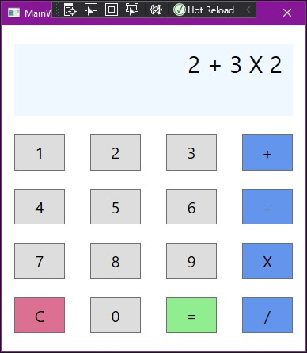

# Calculator-WPF
A simple calculator using C#.


## Basic Calculations

This calculator is capable of all four basic calculation types: division, multiplication, addition and subtraction.

Unfortunately division will not return a decimal because all operations work using int's. By default this will round down to the nearest int value.


### Addition

```csharp
public static int Add(int x, int y)
        {
            return x + y;
        }
```


### Subtraction

```csharp
        public static int Subtract(int x, int y)
        {
            return x - y;
        }
```


### Multiplication

```csharp
        public static int Multiply(int x, int y)
        {
            return x * y;
        }
```


### Division

```csharp
        public static int Divide(int x, int y)
        {
            return x / y;
        }
```


## Unit Tests

Each of the four core calculation types that were implemented were given unit tests, the unit tests were written before the methods.


### Addition Unit Tests

```csharp
[TestCase(3, 5, 8)]
[TestCase(83, 47, 130)]
[TestCase(64, -70, -6)]
public void AddMethodWorksAsIntended(int x, int y, int expected)
{
	int actual = Calculator.Add(x, y);
	Assert.AreEqual(actual, expected);
}
```


### Subtraction Unit Tests

```csharp
[TestCase(7, 2, 5)]
[TestCase(194, 74, 120)]
[TestCase(55, -30, 85)]
public void SubtractMethodWorksAsIntended(int x, int y, int expected)
{
	int actual = Calculator.Subtract(x, y);
	Assert.AreEqual(actual, expected);
}
```


### Multiplication Unit Tests

```csharp
[TestCase(6, 4, 24)]
[TestCase(8, 8, 64)]
[TestCase(100, 90, 9000)]
public void MultiplyMethodWorksAsIntended(int x, int y, int expected)
{
	int actual = Calculator.Multiply(x, y);
	Assert.AreEqual(actual, expected);
}
```


### Division Unit Tests

```csharp
[TestCase(12, 4, 3)]
[TestCase(60, 15, 4)]
[TestCase(-90, 90, -1)]
public void DevideMethodWorksAsIntended(int x, int y, int expected)
{
	int actual = Calculator.Divide(x, y);
	Assert.AreEqual(actual, expected);
}
```


## BODMAS

This calculator only utilises the 'DMAS' part of 'BODMAS' as mentioned above.

The logic for this calculator has a long way to go before being able to preform long calculations but can currently calculate three numbers with two operators for example; 2 + 3 X 2 = 8




### Sorting Logic

In order to preform multiple calculations at once the order of operations must be sorted, in this instance into DMAS order (Division, Multiplication, Addition, Subtraction).


There are four of these if statements, one for each operation type.

```csharp
if (input.Contains('/'))
{
	for (int i = 0; i < input.Count; i++)
	{
		if (input[i].ToString() == "/")
		{
			BODMAS.Append(i.ToString() + i.ToString() + "/" + (i + 1));
			count++;
			divCount++;
		}
	}
}
```

The sort method appends four characters to the end of 'BODMAS' string builder as follows using the example "2 + 3 X 2":

1. The index number of the operation in this example the first sum would be "3 X 2", the index of this sum is index 0.
2. The second number to be appended to 'BODMAS' is the index of the left number in the sum, again in this example the left number would be "3".
3. The third character to be appended to 'BODMAS' is the character of the sum, here this would be "X" to represent multiplication.
4. Finally the right number of the current sum is appended to 'BODMAS'
5. Repeat.

`BODMAS.ToString()` would equal "01X210+1".

In the future this could be separated with a space to improve readability.


Once the order of operations is sorted it is time to preform the operations in that order.

```csharp
if (mulCount > 0)
{
	for (int j = 0; j < BODMAS.Length; j += 4)
	{
		if (BODMAS[j + 2].ToString() == "X" && hasDoneMath == false)
		{
			int num1 = BODMAS[j + 1] - 48;
			int num2 = BODMAS[j + 3] - 48;

			result += Calculator.Multiply(Convert.ToInt32(_nums[num1]), Convert.ToInt32(_nums[num2]));
			hasDoneMath = true;
		}
		else if (BODMAS[j + 2].ToString() == "X" && hasDoneMath == true)
		{
		int num1 = (BODMAS[j - 2].ToString() == "X") ? BODMAS[j + 3] - 48 : BODMAS[j + 1] - 48;
		int num2 = result;

		result += Calculator.Multiply(Convert.ToInt32(_nums[num1]), num2);
		hasDoneMath = true;
		}
	}                    
}
```

This method checks if there is any multiplication to be preformed.

If there is some multiplication within the sum then the next step is to check the index number of the sum.

Going back to the [example above](#Sorting Logic) "01X210+1" the index of the first multiplication is 0 "num1" is set to the index of the left number of the sum and "num2" is set to the index of the right number of the sum.

If at least one other operation has been preformed then "num2" is set to the result of all sums and "num1" is set to either the left or the right number index.


In the future these methods two will likely be combined so that instead of sorting everything in the sum then calculating each part of the sum, these methods could be merged so that the sums are calculated as they are sorted. 


